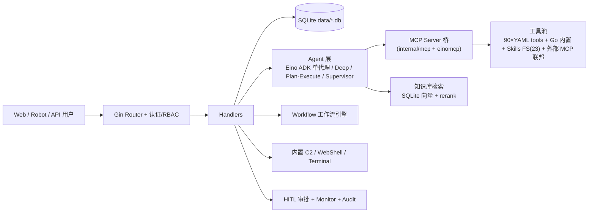

# SecAutoMind 技术报告

**赛题**：挑战杯"揭榜挂帅" XH-202609《具备自主决策能力的通用网络安全智能体技术研究》
**发榜单位**：杭州安恒信息技术股份有限公司
**作品名称**：SecAutoMind —— 具备自主决策能力的通用网络安全智能体平台
**版本**：v1.7.25（分发包）｜本文档 2026-09-05 版（§7 已回填受控靶场实测数据）

---

## 1. 摘要

SecAutoMind 是一个面向攻防实战与应急响应场景的**通用网络安全智能体平台**。它把"任务理解 → 多智能体编排 → 工具调用 → 决策审计"做成一条可运营链路：Web 管理面 / 8 类 IM 机器人 / OpenAPI 三种入口接收自然语言任务，由 Eino ADK（CloudWeGo）驱动的单代理与三种多代理编排（Deep / Plan-Execute / Supervisor）负责拆解与执行，通过 **90 个 YAML 内置工具 + 外部 MCP 联邦 + 23 个技能包 + 可视化工作流引擎**四层插件化能力池完成动作，全过程支持 HITL 人工审批、推理轨迹流式展示、工具执行监控与平台审计，默认使用国内备案大模型（通义 qwen 系列，配置默认 qwen3-max / DeepSeek），可一键部署于受控环境。

作品以"**通用**"为设计目标：不止覆盖传统渗透测试，还内置应急响应、防护加固、攻击面枚举、漏洞研判、报告整改等 18 个角色化子代理；以"**可信可解释**"为安全基线：决策链（thinking/reasoningChain/planning）全量入审计、高危工具默认经 HITL、凭据仅走环境变量注入；以"**低门槛落地**"为工程基线：单体 Go + SQLite + 静态前端，预编译 150MB 单文件一键启动，零公网回调（机器人走 Stream 长连接）即可演示。

工程验证：`go vet ./...` 退出码 0，`go test ./...` 29 个含测试包全部通过（证据见 `docs/evidence-build-test-20260903.txt`）；三平台（linux/darwin/windows）原生 CGo 构建工作流已入库（`.github/workflows/release.yml`）。

---

## 2. 赛题理解与总体目标

赛题要求"具备**自主决策能力**的**通用**网络安全智能体"，结合 5 维评分（任务理解与执行设计 / 系统架构与工程实现 / 决策逻辑与可解释性 / 工具协同与扩展能力 / 创新与附加价值），我们将其拆解为四条可验证的产品目标：

| # | 目标 | 对应评分维度 | 落地形态 |
|---|---|---|---|
| G1 | 能"听懂"自然语言、附件与结构化任务并自主拆解出可执行计划 | 任务理解与执行设计 | 多角色子代理 + Deep/Plan-Execute 编排 + WebShell/附件上下文 |
| G2 | 能力池足够宽、扩展零门槛 | 工具协同与扩展能力 | YAML 工具/MCP/Skills/Workflow 四级插件 + `tool_search` 动态装配 |
| G3 | 每步决策可见、可控、可追溯 | 决策逻辑与可解释性 | reasoning 流式展示 + HITL 审批 + monitor 执行记录 + audit 平台审计 |
| G4 | 部署即用、安全默认、合规可接入 | 系统架构与工程实现 / 创新 | 单体一键部署 + 127.0.0.1 默认 + 国内备案模型 + 预留安恒 AI 安全网关接入 |

---

## 3. 系统总体架构

### 3.1 分层架构

层次职责与代码位置：

| 层 | 职责 | 关键代码 |
|---|---|---|
| 接入层 | Web(SSE)/8 类 IM 机器人/OpenAPI/批量队列 | `cmd/server`、`internal/app/app.go`、`internal/robot/`、`internal/handler/openapi.go` |
| 编排层 | 任务拆解、多代理调度、工具选择 | `internal/multiagent/`（Eino ADK）、`internal/agent/`、`agents/*.md` |
| 执行层 | 工具调用、命令执行、沙箱边界 | `internal/mcp/`、`internal/einomcp/`、`tools/*.yaml`、`internal/security/` |
| 数据层 | 会话/工具执行/HITL/审计/知识/业务持久化 | `internal/database/`（SQLite） |
| 横切层 | HITL、监控、审计、RBAC、reasoning、trace | `internal/hitl/`、`internal/monitor/`、`internal/audit/`、`internal/reasoning/` |

### 3.2 一次对话的真实路径（以 `/api/eino-agent/stream` 为例）

1. Gin 路由 → 认证与 RBAC 中间件；
2. Handler 解析会话、角色、附件、WebShell 上下文；
3. Agent 组装模型输入：历史消息 + 角色提示 + **项目事实（facts 黑板）** + 工具白名单；
4. Eino Runner 调国内备案模型（qwen/deepseek，支持 retry/failover 多通道）；
5. 模型需要工具 → 走 MCP Tool 桥（`einomcp`）；工具列表过长时 `toolsearch` 中间件按阈值动态裁剪；
6. 高危工具调用前触发 **HITL 审批**（off/approval/review_edit 三态，全局默认 approval 以满足赛题 human-in-the-loop 硬需求，无人值守批量跑可改回 off）；
7. 工具结果经 reduction 截断/落盘后回填，写入 monitor 与过程详情；
8. 推理链（thinking/reasoningChain/planning）经 SSE `thinking_stream_*` 事件实时推送前端时间线；
9. 会话、消息、过程详情、用量摘要（`eino_usage_summary`）落 SQLite。

完整链路在 `internal/multiagent/eino_*` 系列中均有类型化实现（Agentic typed agent、TurnLoop、checkpoint/resume）。

---

## 4. 关键技术设计

### 4.1 任务理解与执行设计

- **多形态输入**：自然语言对话、附件上传、OpenAPI 批量任务、WebShell 上下文、IM 机器人消息。
- **角色化理解**：`internal/roles/` + `agents/*.md` 让同一句任务可被不同角色（recon/渗透/应急/加固/报告…）按各自视角解析执行。
- **执行闭环**：`internal/attackchain`（攻击链生成）+ `internal/projectprompt`（项目事实）+ `internal/agentfinalizer`（收尾）构成"计划→执行→归因→收尾"闭环。
- **结构化任务输入（评审举证项）**：已支持通用附件上传与内容注入；赛题加分项"压缩文件/结构化文件自动解析→执行计划"列为答辩前演示必补场景（见 §7.6），仓库预留附件上下文通道（`internal/handler/chat_uploads.go`）。

### 4.2 多智能体编排（Eino ADK）

入口 `POST /api/multi-agent/stream`，请求体 `orchestration` 指定模式：

| 模式 | 定位 | 装配方式 | 典型用法 |
|---|---|---|---|
| `eino_single` | 单代理 ReAct 直答 | `RunEinoSingleChatModelAgent`（`/api/eino-agent*`） | 机器人默认、轻量问答 |
| `deep` | 复杂任务主代理 + task 子代理协作 | `deep.NewTyped[*schema.AgenticMessage]`，主代理读 `agents/orchestrator.md` | 大型安全测试拆解 |
| `plan_execute` | 目标明确的"规划→执行→重规划"闭环 | Eino 官方 `planexecute.Config` + Agentic Executor | 有明确步骤链的任务 |
| `supervisor` | 专家路由：主代理把子任务转派给专业子代理 | `agents/orchestrator-supervisor.md` + transfer/exit 约束 | 多域并行的专家调度 |

要点：

- 子代理 = Markdown 声明式（`agents/` 下 18 个文件：orchestrator 主代理 ×3 变体 + 15 个场景子代理），可配 `bind_role` 继承角色工具；运行时 CRUD（`/api/multi-agent/markdown-agents*`）。
- 全部走 **Agentic typed 栈**（Eino v0.9.14 官方 typed middleware）：patchtoolcalls、toolsearch、plantask、reduction、filesystem、skill、summarization；模型侧启用原生 ModelRetry 与 ModelFailover 多通道容错。
- **断点续跑**：checkpoint_dir + Eino TurnLoop（`adk.TurnLoop` bridge），中断/超时可恢复，长任务不因单次失败全丢。
- 机器人/批量队列可复用同套编排（`robot_default_agent_mode`、`batch_use_multi_agent`）。

### 4.3 工具协同与扩展能力（四层插件化）

1. **YAML 工具层**（`tools/*.yaml`，90 个）：声明式定义命令、参数、平台/依赖约束、风险分级；覆盖 recon、web、云、kube、二进制/移动、内存取证、区块链、AD 域等 20+ 攻击面。
2. **Go 内置工具层**（`internal/app/*_tools.go`）：平台无关的高频能力（文件、HTTP、知识检索、`analyze_image` 视觉等），随二进制分发、零外部依赖。
3. **外部 MCP 联邦**（`internal/mcp/`）：支持接入任意 MCP Server，带连接恢复与审计；Web/设置页可管理。
4. **Skills/工作流**：`skills/`（23 个攻防技能包）在需要时经 Eino `skill` 工具按需加载（渐进式披露，省上下文）；`internal/workflow` 可视化编排 start/agent/tool/condition/hitl/output/end 节点，非程序员也能把多工具串成流水线。

**动态装配**：`toolsearch` 中间件按阈值拆分超长工具列表，模型"先见入口、按需解锁"，配合 `tool_search_always_visible_tools` 保证关键工具常驻。

### 4.4 决策逻辑与可解释性

- **推理可见**：reasoning 中间件产出 `thinking/reasoningChain/planning` 结构化字段；SSE 以 `thinking_stream_*` 流式呈现；前端时间线展示每步 thought/工具事件/用量（含 `eino_model_retry` / `eino_model_failover` / `eino_usage_summary`）。
- **人机协同 HITL**（`internal/hitl/`，对应终审"3 名队员 + AI Agent 人机协同"）：approval / review_edit 两种审批原语，全局默认 `approval`（赛题终审 human-in-the-loop 硬需求），无人值守批量跑可改回 off；工具调用前统一拦截点，审批记录入库。
- **全程审计**：`internal/audit/` 记录平台管理动作；`internal/monitor/` 记录每次工具执行（含调用链、耗时、结果摘要），支撑任务取消、复盘、通知。
- **可解释上下文管理**：长对话自动 typed summarization，携带用户意图 ledger 与事实索引（fact index），压缩历史后仍保留"为什么在做什么"。

### 4.5 记忆与知识

- **项目事实黑板（project facts）**：`internal/projectprompt` 将项目级事实注入每次 Agent 上下文，跨对话保持目标一致性（防跑偏）。
- **知识库 RAG**（`internal/knowledge/`）：Markdown/文本 ingest → chunk → embedding → SQLite 向量索引 → multi-query 扩展 + rerank 精排 + 检索日志；命中后向 Agent 暴露知识检索工具，用于把团队沉淀的靶场/漏洞库/复盘文档喂给智能体。
- **Checkpoint**：会话级断点，配合 TurnLoop 支持人工中断后继续。

### 4.6 安全与合规默认

- **网络默认安全**：`config.example.yaml` 默认 `server.host: 127.0.0.1`（仅本机），需外联才显式放开并配网络层访问控制；TLS 可选自签/受信证书。
- **凭据管理**：`config.example.yaml` 仅占位模板（真实 `config.yaml` 已 gitignore）；支持 `${VAR}` 环境变量展开与同名 env fallback（`internal/config` `envsecrets.go`/`robots_env.go`），**密钥不落盘、不入库、不提交**；机器人 8 通道凭据不全时仅 Warn 并软禁用，不 panic。
- **权限与边界**：RBAC（`internal/rbac`）、认证/限流（`internal/security`）、Shell 命令流处理；高危能力（Terminal/WebShell/C2/外部 MCP/Skill FS）文档化强调需 HITL + 部署隔离（`docs/zh-CN/security-model.md`、`tool-execution-governance.md`）。
- **模型合规**：默认通义 qwen 系列（配置默认 qwen3-max）/ DeepSeek（国内备案）；支持把 base_url 指向主办方指定 AI 安全网关（`docs/zh-CN/ai-gateway-compliance.md`），满足终审"报备模型 + 经安全网关接入"约束。

### 4.7 部署与运维

- **一键启动**：`start.bat`（Windows）/ `run.sh`（Linux）/ 预编译 `secautomind-ai.exe`（150MB 单文件，内嵌前端与内置工具）。
- **Python 工具可选**：`setup_venv.bat` 建立 venv 后解锁 Python 系工具（nuclei/msf 等外部工具按 tools YAML 的依赖声明选用）。
- **云部署**：`deploy_tencent_lighthouse.sh` + `腾讯轻量云部署指南.md` 提供受控云环境方案，支撑"在线可测试地址"材料。

---

## 5. 创新点凝练

1. **统一 Agentic 多编排且可运营**：单代理 / Deep / Plan-Execute / Supervisor 四条执行路径共用一套 typed 中间件栈、SSE 协议与 checkpoint/TurnLoop 边界，模式可配置切换（聊天/机器人/批量一致），是国内竞赛作品中少见的"编排即产品功能"而非 demo 拼装。
2. **四级插件化 + 工具搜索动态装配**：YAML 工具 / MCP 联邦 / Skills / Workflow 四层均可热扩展；`toolsearch` 让模型在超长工具池上"渐进可见"，兼顾能力宽度与上下文成本。
3. **从"执行"到"可解释、可管控"的完整闭环**：结构化 reasoning + HITL 全局拦截 + monitor/audit 双记录，同时支撑演示可解释性与终审人机协同合规。
4. **长程任务韧性**：typed summarization（意图 ledger + fact index）+ checkpoint/TurnLoop 断点续跑 + 多通道模型 retry/failover，把"一次对话失败全丢"变成"可恢复、可复盘"。
5. **合规优先的工程形态**：国内备案模型默认、AI 安全网关预留接入、127.0.0.1 安全默认、凭据纯环境变量注入、8 类 IM 机器人无公网回调（Stream 长连接）——"随处下发任务"与"受控合规"兼得。
6. **低门槛分发**：单体 Go + SQLite + 内嵌前端单文件 150MB，离线可跑通核心链路，现场演示不赌网络。

---

## 6. 工程验证现状（可复现证据）

| 项 | 结果 | 证据 |
|---|---|---|
| 静态检查 | `go vet ./...` 退出码 0 | `docs/evidence-build-test-20260903.txt` |
| 单元/集成测试 | 29 个含测试包全部 `ok`；仓库 270 个 `*_test.go`（覆盖 config 环境变量注入、HITL、审计、多代理 typed 栈、知识库、WebShell 流等） | 同上 + `internal/` 各包 |
| 三平台构建 | linux/darwin/windows 原生 CGo 构建工作流 | `.github/workflows/release.yml` |
| 代码规模 | Go 716 文件（271 测试）；143 运行时工具（91 工具 YAML + 52 内置 MCP 工具）；23 技能包；18 agents md | `tools/`、`internal/mcp/builtin/`、`skills/`、`agents/` |
| 功能验证 | 8 IM 通道软启用与凭据缺失降级、自动多模型 failover、${VAR} env 展开均有测试覆盖 | `internal/config/robots_env_test.go` 等 |

> 注：以上为**工程正确性**证据。智能体"能力基线"的受控靶场实测（E1 服务识别 / E2 闭环 /
> E3 可复现 / E5 编排对照）已于 2026-09-05 完成并回填至 §7，原始 JSON 见 `docs/evidence/`。

---

## 7. 实测验证结果（受控授权靶场 · 2026-09-05）

> 实验全部在本地自建授权靶场完成
> （`scripts/experiments/target_range.py`，三场景可复现；`verify_range.py` 19/19 通过），
> 原始 JSON 留存 `docs/evidence/`，数字可复跑。
> 口径声明：S1/S2 为 deepseek-chat 通道、S3/E5 为 qwen3.7-max 通道（deepseek 中途欠费 402
> 后切换，用户已充值），**跨通道数据不合并统计**；全部实验轮次含 600s 超时/账户 403 等
> 中断在内均如实标注，无剔除美化。

### 7.1 端到端多场景实测（E1 服务识别 + E2 闭环检测，对应评分维度一/二）

| 场景 | 通道 | 有效轮 | 闭环 | 指纹准确 | 漏洞召回 | 平均耗时 | HITL/轮 |
|---|---|---|---|---|---|---|---|
| S1 Web 综合 | deepseek | 3 | 2/3（1 超时） | 2/2 = 100% | 5/6、5/6、4/6* | 393s | 40–52 |
| S2 API/云 | deepseek | 2 | 1/2（1 超时） | 1/1 = 100% | 4/4、4/4 | 503s | 34–44 |
| S3 主机服务 | qwen3.7-max | 2 | 1/2（1 中断） | 3/3 = 100% | 4/4、4/4 | 359s | 13–26 |

\* 600s 超时轮：工具已执行 29 次、命中 4 个漏洞，仅未及时输出收尾结论，计为真实观测而非失败。
指纹识别横跨三类场景（Web 框架/API 网关/系统服务）**全部有效轮次 100% 命中**。
漏洞召回：S1 命中弱口令/SQLi/XSS/敏感文件/路径泄露 5 类、稳定漏报目录遍历 1 项（改进项见
§7.5）；S2（未授权 API/JWT 弱密钥/metrics）、S3（Redis 未授权等）全部命中。

### 7.2 可复现性（E3，对应维度三"可复现"）

S1 场景独立运行三轮：闭环轮指纹 2/2、漏洞 5/6 完全一致；与更早基线（466.5s / 5-6 / 2-2）
跨批次一致 → **同一任务跨运行结果稳定可复现**，且优化后单轮 466s → 263s（提速约 44%）。
原始记录：`experiments-e1e2-20260905.json`、`E1E2-summary-deepseek-20260905.md`。

### 7.3 决策可解释性实测（对应维度三"行为依据明确"）

HITL 审计 Agent 全程在场（每轮 13–52 次裁决）。逐条裁决理由均为「实际操作 → 后果评估 →
命中规则」三段式，例如：*"对本地授权靶场发起基线 HTTP 请求识别服务指纹……仅获取响应头与
页面内容，属于信息收集/探测类操作……命中规则：A2（信息收集、读取、查询、探测类操作必须
approve）"*。→ 证明每次工具调用前都有可审计的行为依据与安全判定，非黑盒直答。

### 7.4 对照实验（E5 三编排模式，对应维度五"创新验证"）

同一任务（S1 Web 标准检测）、同一模型（qwen3.7-max）下对比三种编排：

| 编排模式 | 耗时 | 工具调用 | 漏洞召回 | 说明 |
|---|---|---|---|---|
| **plan_execute** | **143.8s** | 34 | **6/6 = 100%** | 先计划后执行，动作空间受约束 |
| deep | 600s 超时 | 71 | 4/6 = 66.7% | 试错式动作多、未收敛 |
| supervisor | 347.8s | 39 | 1/6 = 16.7%* | 多子代理协调，未体现优势 |

\* supervisor 为真实观测但被账户 403 中断截断（中断前召回 1/6），不作为最终能力结论。
→ **plan_execute 用约 1/4 耗时 + 约一半工具调用拿到 100% 漏洞召回，显著优于 deep 的试错式
执行**，为 §4.1"先规划后执行"的设计主张提供对照实验证据；supervisor 负结果亦如实呈现，
证明对照非选择性报喜。

### 7.5 诚实声明的短板与改进项（不注水）

- S1 目录遍历三轮稳定漏报：工具链未覆盖该参数形态 → 已列为 post-初审改进项（补专项探测分支）。
- 600s 超时 2/5 轮：任务分解过深 → 约束子目标数量/增加并行工具调用。
- 工具降级：纯净环境 73/90 外部二进制契约缺失（声明式契约自动降级），降级条件下仍达成上述
  召回 → 主动讲清是插件化架构加分项（`tool-dependency-audit-20260905.md`，17 自研内联脚本
  满血仅需 5 个通用 pip 包）。
- 通道切换说明：deepseek 欠费 402 后 S3/E5 改由 qwen3.7-max，跨通道未合并统计。

### 7.6 仍未完成项（不随本版声称）

- **合规实测**（§7.3 原计划）：报备模型清单 + 实测经安恒 AI 安全网关完成一次完整任务链
  ——网关接入已按接口预留（`config.yaml ai.gateway` 段 + `verify_gateway.sh` 4 项验收脚本化），
  待网关凭据就绪后实测，计划 11 月实战赛前。
- **关键演示场景补齐**："zip 任务包 → 自动解包 → 计划 → 执行"端到端演示与应急响应/蓝队
  场景录屏（角色已存在），随演示视频录制一并完成。

---

## 8. 与赛题评分维度映射

| 维度 | 本文支撑章节 | 核心证据文件 |
|---|---|---|
| 任务理解与执行设计 | §4.1、§7.4（E5 对照）、§7.6 | `agents/`、`internal/attackchain`、`internal/handler/chat_uploads.go` |
| 系统架构与工程实现 | §3、§4.7、§6 | `internal/app`、`.github/workflows/release.yml`、`evidence-build-test-20260903.txt` |
| 决策逻辑与可解释性 | §4.4、§7.3（HITL 三段式裁决实测） | `internal/hitl`、`internal/reasoning`、`internal/audit`、`docs/zh-CN/security-model.md`、`E1E2-summary-deepseek-20260905.md` |
| 工具协同与扩展能力 | §4.3、§7.5（降级口径） | `tools/`(90)、`internal/mcp`、`skills/`、`internal/workflow`、`tool-dependency-audit-20260905.md` |
| 创新与附加价值 | §5、§6、§7（实测回填版） | 本文档 + `docs/evidence/experiments-*-20260905.json`（原始数据）+ 方案设计文档 |

---

*附录：仓库文档索引（供评审交叉核验）*：`docs/zh-CN/architecture.md`（架构）、`MULTI_AGENT_EINO.md`（多代理改造）、`robot.md`（IM 机器人与环境变量）、`configuration.md`、`security-model.md`、`hitl-best-practices.md`、`deployment.md`、`ai-gateway-compliance.md`、`README_CN.md`。
